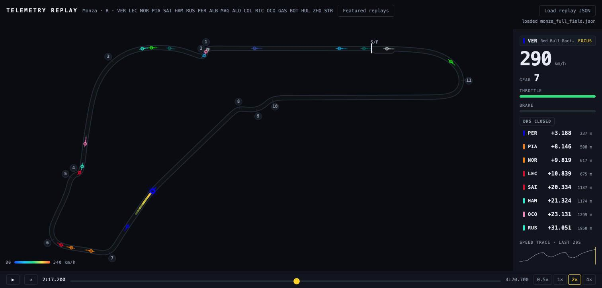
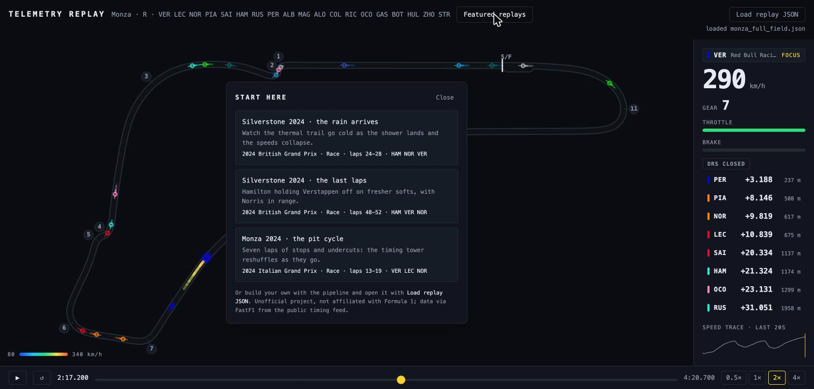

# F1 Telemetry Replay



A browser-based Formula 1 telemetry replay: real cars lapping a real circuit on one
shared clock, with a live timing tower, per-car telemetry and thermal speed trails.
No backend, no streaming — validated telemetry JSON, a Canvas 2D renderer and a
single animation loop.

### ▶ [Try it live](https://f1-telemetry-replay.vercel.app) — open it and click a **featured replay**

Three curated scenarios load in one click, each landing you inside the moment rather
than at an empty start line:

| | |
|---|---|
| **Silverstone 2024 · the rain arrives** | Laps 24-28. The thermal trail goes cold as the shower lands and lap times fall off a cliff — 1:31 to 2:00 in five laps, then the scramble for intermediates. |
| **Silverstone 2024 · the last laps** | Laps 48-52. Hamilton on softs holding off Verstappen on hards, half a second a lap quicker, with Norris fading behind. |
| **Monza 2024 · the pit cycle** | Laps 13-19. Stops and undercuts, and a timing tower that reshuffles as they land. |



---

## Run your own sessions

The featured replays are three committed excerpts. The pipeline will build a replay
from **any** session FastF1 can reach — that part runs on your machine, deliberately,
because the deployed app never contacts the timing feed.

```bash
# 1. the pipeline (needs network; Python 3.10+)
cd pipeline
python -m venv .venv && source .venv/bin/activate
pip install -r requirements.txt

# one driver's fastest lap
python build_replay.py --year 2024 --gp Monza --session Q \
    --driver LEC --out ../app/public/data/monza_lec.json

# or several cars over a shared session-time window, named by a lap range
python build_replay.py --year 2024 --gp Monza --session R \
    --drivers VER,LEC,NOR --laps 13-19 --out ../app/public/data/monza_race.json
```

Every build validates its own output through the app's real schema before it exits,
and reports the numbers behind it — motion fidelity per car, time-base stretch, file
size. Then:

```bash
# 2. the app
cd app && npm ci && npm run dev
```

Open it and use **Load replay JSON** to pick the file you just built. `npm run check`
runs every gate: typecheck, lint, format, tests with coverage thresholds, and build.

## How it works

**One clock, in a ref.** A single `requestAnimationFrame` loop owns playback. The
store holds only discrete state a human changes; the HUD reads an interpolated
snapshot at ≤30 Hz through a separate channel. Nothing calls `setState` per frame, and
the canvas subscribes to nothing — a property pinned by a test, not a convention.

**One contract.** A Zod schema is simultaneously the runtime validator and the
TypeScript type. Every replay — committed fixture, generated session, featured
scenario — crosses it at load and fails loudly with the exact path
(`→ at cars[0].samples[3].speed`). The Python pipeline is checked against the app's
own `parseReplay`, not a second copy of the rules.

**A pure, headless engine.** `app/src/engine/` imports nothing from React or the DOM:
O(1) interpolation over a uniform time grid, geometry, thermal colour mapping, gap and
running-order computation with lap unwrapping. Held at 100% per-file coverage by a
threshold that fails the build, not by good intentions.

**Positions parameterised by travel, not time.** F1 position and speed arrive from
different sensors at different rates; interpolating jittery position timestamps made
the car visibly surge on straights. Re-deriving positions from the integral of the
speed channel took implied-vs-actual speed correlation from **r = 0.70 to r = 0.9998**.

**Offline by default, with one narrow exception.** The app boots from a committed
fixture with zero network. It may fetch its own committed gallery assets from its own
origin — nothing else. Tests and CI never touch the network at all, enforced by a stub
that throws on any unmocked `fetch`.

## Deeper

- **[docs/PROJECT_SUMMARY.md](docs/PROJECT_SUMMARY.md)** — what was built, the
  architecture decisions, and the findings worth keeping: the surging dot, the tower
  that lied at field density, the instrument that lied first.
- **[PLAN.md](PLAN.md)** — the build history. Every slice carries its acceptance
  evidence: before/after tables, measurements, and the decisions that were reversed
  when a measurement contradicted them.
- **[CLAUDE.md](CLAUDE.md)** — the law the codebase is held to.
- **[PRD.md](PRD.md)** — scope and load-bearing decisions.

## Stack

Vite · React (render layer only) · TypeScript · Zod · Zustand · Canvas 2D · Vitest with
per-file coverage thresholds · Python 3.10+ with FastF1, numpy and pytest · GitHub
Actions (one required check spanning both languages) · Vercel.

## Attribution

Unofficial and unaffiliated. Not associated with, endorsed by, or connected to
Formula 1, the FIA, or any F1 team. Data is accessed through
[FastF1](https://github.com/theOehrly/Fast-F1) from Formula 1's publicly available
timing feed, for personal and educational use; the featured replays are a small set of
curated historical excerpts. See **[NOTICE](NOTICE)** for the full statement.

Source code is [MIT licensed](LICENSE). That covers the code, not the underlying data.
